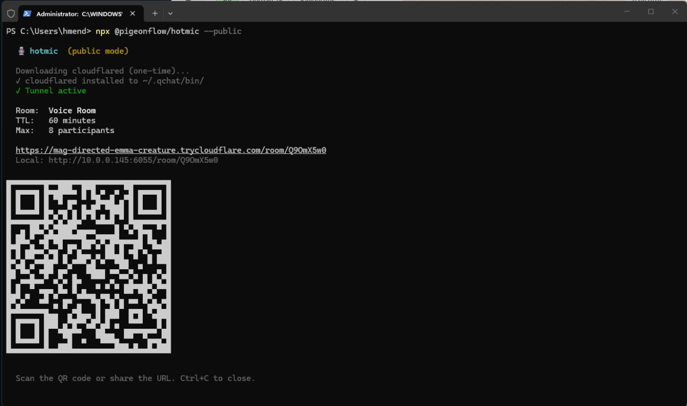

# hotmic 🎙️

<p align="center">
  
</p>

Disposable voice rooms from your terminal. One command, one QR code, zero signup.

```bash
npx @pigeonflow/hotmic
```

That's it. Scan the QR, talk.

## Why

Every voice call tool wants you to create an account, download an app, verify your email, accept terms, update the app, and then *maybe* you can talk.

hotmic is for when you just need to talk to someone. Right now.

## How it works

1. You run `hotmic`
2. It starts a local server and prints a QR code
3. People scan it and join from their browser
4. WebRTC connects everyone peer-to-peer
5. Audio never touches the server

The server only handles signaling (who's in the room, WebRTC negotiation). All voice data flows directly between participants.

## Features

- **Zero config** — `npx` and go
- **Peer-to-peer audio** — WebRTC mesh, no relay server
- **Works on any device** — phone, tablet, laptop, anything with a browser
- **Public mode** — `--public` creates a Cloudflare tunnel, instant HTTPS
- **Voice visualizer** — real-time frequency bars around each participant
- **Reconnection** — drop your connection, come back, keep talking
- **Password protection** — `--password secret` for private rooms
- **SVG everything** — crisp icons at every size, no emoji rendering issues

## Usage

```bash
# Quick room (60 min TTL, up to 8 people)
npx @pigeonflow/hotmic

# Named room, stays open until everyone leaves
npx @pigeonflow/hotmic --name "standup" --persist

# Public room with password (accessible from anywhere)
npx @pigeonflow/hotmic --public --password "shhh"

# LAN with HTTPS (mic works without tunnel)
npx @pigeonflow/hotmic --https

# Custom limits
npx @pigeonflow/hotmic --max 4 --ttl 30 --name "quick sync"
```

## Flags

| Flag | Default | Description |
|------|---------|-------------|
| `--name <name>` | random | Room name |
| `--public` | off | Expose via Cloudflare tunnel (HTTPS) |
| `--https` | off | Self-signed HTTPS for LAN (mic works without tunnel) |
| `--persist` | off | Room lives until last person leaves |
| `--password <s>` | none | Require password to join |
| `--ttl <min>` | 60 | Room time-to-live in minutes |
| `--max <n>` | 8 | Max participants |
| `-p, --port <n>` | random | Server port |

## Architecture

```
┌─────────┐     WebSocket      ┌──────────┐     WebSocket      ┌─────────┐
│ Phone A ├────(signaling)──────┤  hotmic  ├────(signaling)──────┤ Phone B │
│ browser │                     │  server  │                     │ browser │
└────┬────┘                     └──────────┘                     └────┬────┘
     │                                                                │
     └──────────── WebRTC (voice, peer-to-peer) ──────────────────────┘
```

The server weighs ~50KB. It handles room state and WebRTC signaling. Audio goes directly between browsers via WebRTC with STUN-assisted NAT traversal.

Mesh topology caps at ~8 participants (each peer connects to every other peer). This is intentional — hotmic is for quick syncs, not conferences.

## Limitations

- **HTTPS required for mic access** — use `--public` for a tunnel, `--https` for a self-signed cert on your LAN, or access via `localhost`. Plain HTTP on a LAN IP won't prompt for microphone permission (browser security policy).
- **STUN only** — works for ~80% of network configurations. Symmetric NATs and strict corporate firewalls may block peer connections. TURN relay support is planned.
- **Mesh topology** — each participant connects to every other. Works great for 2-8 people, won't scale to 50.

## Requirements

- Node.js 18+
- A browser with WebRTC support (all modern browsers)
- Microphone (obviously)

## License

MIT

## Author

[@pigeondev_](https://x.com/pigeondev_)
